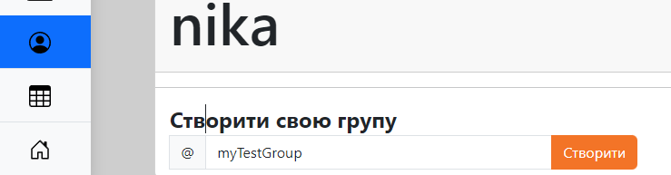
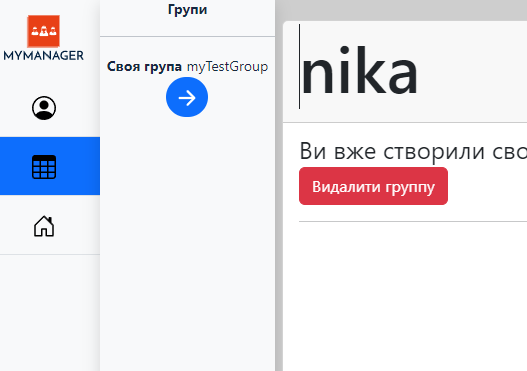
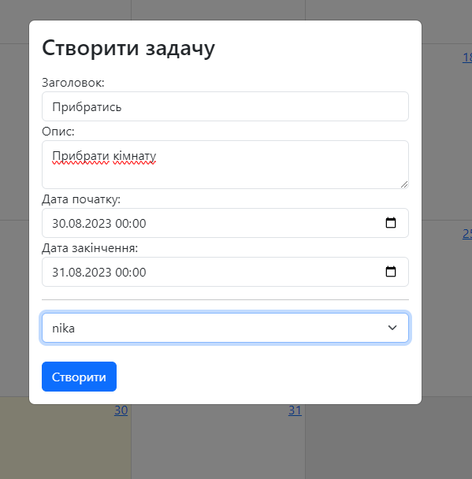
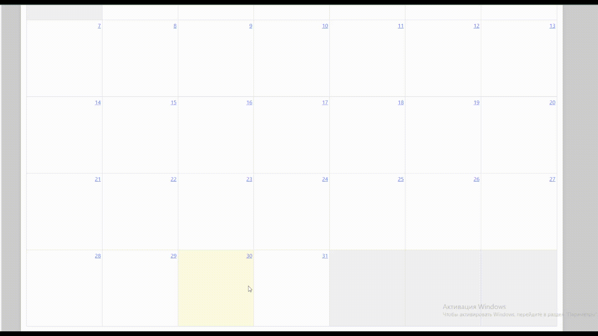

# MyTaskManager Проект

MyTaskManager - це проект управління задачами, розроблений на Java Spring та FullCalendar framework. Цей проект допоможе вам ефективно організувати свої завдання, відстежувати їх виконання та планувати робочий процес.

# Основні функціональності

- Додавання нових завдань з описом, датою початку задачі, датою  заврешення, призначати задачу іншим користувачам.
- Перегляд списку запланованих завдань.
- Позначення завдань як виконаних та видалення завдань.
- Можливість створення облікового запису користувача.
- Можливість створення групи з користувачів.

# Вимоги до середовища

- Java 8 або вище
- Maven
- Intellij IDE
- Docker & Docker Compose

# Інструкція з встановлення
Ви можете перейти на сам сайт по URL: [https://probable-rabbit-production.up.railway.app/registration](https://my-task-manager.up.railway.app/registration), або скористатись інструкцією нижче

1. Клонуйте репозиторій до вашого локального середовища: [https://github.com/n1kkita/taskManager](https://github.com/n1kkita/taskManager.git)

2. Відкрийте консоль та перейдіть до корню проекту. Введіть команду `docker compose up.`

3. Зачекайте, поки Docker Сompose завершить процес створення та запуску контейнерів. Це може зайняти деякий час, залежно від вашої системи та швидкості Інтернет-з'єднання.
   
   **P.S**
   
   **Якщо на пк раніше не було встановлено docker-image mysql** то при першій спробі виконати `docker compose up`, при запуску проекту **виникне помилка зєдання з базою даних**. Для цього треба просто **повторити команду** `docker compose up.`
   
5. Після успішного створення контейнерів відкрийте ваш веб-браузер і перейдіть за адресою [http://localhost:8080/authentication](http://localhost:8080/authentication)

# Інструкція з використання
- Після реєстрації ви потрапите на свій профіль де ви зможете стоврити свою групу. Один користувач може мати тільки **ОДНУ** свою групу
    

 <!-- Вирівнюємо вміст по центру -->
  

  

- Після створення групи ви можете додати до неї участиників або перейти до самої групи
  
    

 <!-- Вирівнюємо вміст по центру -->
  

  

- Після переходу до групи ви побачите календар на якому будет поточний місяць
- **ДЛЯ СТВОРЕННЯ ЗАДАЧІ**: наведіть на потрібну дату нажміть **ЛКМ**, зявиться вікно де вам треба вказати назву задачі, опис, вказати користувача якому буде призначено цю задача. Також за необхідності ви можете вказати більш  точну дату початку та звершення задачі

    

 <!-- Вирівнюємо вміст по центру -->
  

  

- **ДЛЯ СТВОРЕННЯ ЗАДАЧІ**: також можна обрати одразу декілька дат, для цього наведіть на потрібну дату зажміть **ЛКМ** та проведіть по потрібних датах

 
  
- Після створення задачі їй присвоється статус. У задачі може бути наступний статус: **Виконано**, У **процессі**, **Провалено**, **Створенно**. Як саме присвоюєтся статус задачі можна почитати нижче
- Після створення задачі вона зявиться на календарі, ви можете натиснути на неї **ЛКМ** і зявиться вікно з інформацією про задачу а також можловисті
  - Редагувати задачу
  - Помітити як виконану
  - Видалити задачу 

# Особливості

### Як визначається статус для задачі?

- **Створено**: призначаєтся задачам якщо поточна дата не дійшла до дати старту
- **У процессі**: призначаєтся задачам якщо поточна дата вже дійшла до дати старту але не дійшла до дати заврешення
- **Виконанно**: призначаєтся задачам якщо до дати завершення користувач **ВСТИГ** позначити задачу як виконанна
- **Провалено**: призначаєтся задачам якщо до дати завершення користувач **НЕ ВСТИГ** позначити задачу як виконанна
  
### В чому різниця ROLE_ADMIN та ROLE_USER?
Після того як користувач створив свою группу, його роль в цій грппі автоматично присвоюється **ROLE_ADMIN**

Користувач може додати до своєї группи інших людей. Їхня роль автоматично буде **ROLE_USER**

## ROLE_USER
**НЕ МОЖЕ:**
  - створуювати, редагувати, видаляти задачу
  - помічати задачу виконаною якщо вона не присвоєна йому
  - помічати задачу виконаною статус якої **Провалено**

**МОЖЕ:**
  - помічати задачі зі статусом **У процессі**, **Створено** якщо вони присвоєні їм

## ROLE_AMIN
**МОЖЕ:**
  - створювати задачі, редагувати, видаляти, помічати виконаним задачі, незалежно від статусу та кому присвоєна задача

# Технології які використовувались у проекті
- Java
- Spring Boot
- Spring Data
- Strping Web
- Thymeleaf
- MySql
- Lombok
- Docker & Docker Compose
- Maven
- HTML
- CSS
- Bootstrap
- JS
- Flyway
- FullCalendar

## Автор
MyTaskManager був створений [https://t.me/n1kkitaaa](https://t.me/n1kkitaaa)
