# MyTaskManager Проект

MyTaskManager - це проект управління задачами, розроблений на Java Spring та FullCalendar framework. Цей проект допоможе вам ефективно організувати свої завдання, відстежувати їх виконання та планувати робочий процес.

# Інструкція з відкриття
Ви можете перейти на сам сайт по URL: [https://acrid-stomach-production.up.railway.app/authentication](https://acrid-stomach-production.up.railway.app/authentication) 

# Інструкція з використання
- Після реєстрації ви потрапите на свій профіль де ви зможете стоврити свою групу. Один користувач може мати безліч своїx груп
    

 <!-- Вирівнюємо вміст по центру -->
  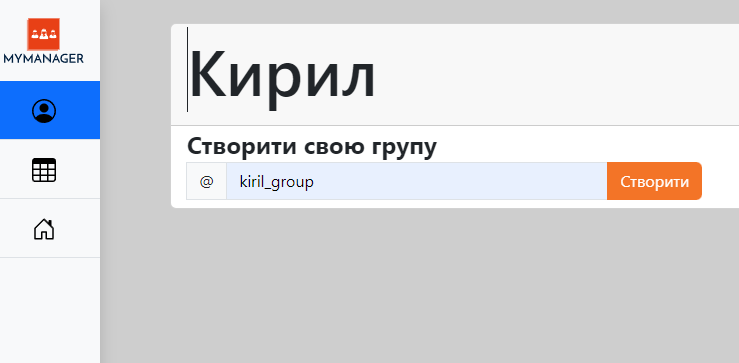

  

- Після створення групи ви можете додати до неї участиників або перейти до самої групи
  
    

 <!-- Вирівнюємо вміст по центру -->
  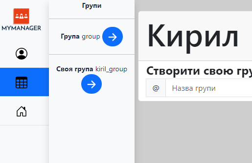

  

- Після переходу до групи ви побачите календар на якому будет поточний місяць
- **ДЛЯ СТВОРЕННЯ ЗАДАЧІ**: наведіть на потрібну дату нажміть **ЛКМ**, зявиться вікно де вам треба вказати назву задачі, опис, вказати користувача якому буде призначено цю задача. Також за необхідності ви можете вказати більш  точну дату початку та звершення задачі

    

 <!-- Вирівнюємо вміст по центру -->
  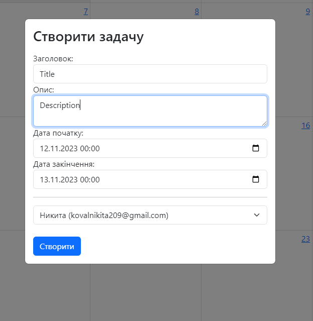

  

- **ДЛЯ СТВОРЕННЯ ЗАДАЧІ**: також можна обрати одразу декілька дат, для цього наведіть на потрібну дату зажміть **ЛКМ** та проведіть по потрібних датах
  
 

- Після створення задачі, як тілький ії статус буде змінюватися, на електрону почту користувача якому назначено цю задач буде приходити повідмолення про її зміну.(поки що, повідомлення можуть приходити на @gmail.com електроні почти)
  
- Після створення задачі їй присвоється статус. У задачі може бути наступний статус: **Виконано**, У **процессі**, **Провалено**, **Створенно**. Як саме присвоюєтся статус задачі можна почитати нижче
- Після створення задачі вона зявиться на календарі

    

 <!-- Вирівнюємо вміст по центру -->
  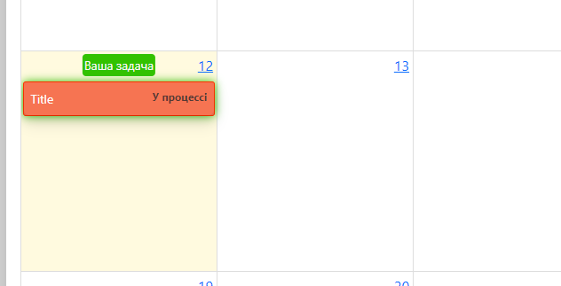

  

- Ви можете натиснути на неї **ЛКМ** і зявиться вікно з інформацією про задачу а також можловисті

    

 <!-- Вирівнюємо вміст по центру -->
  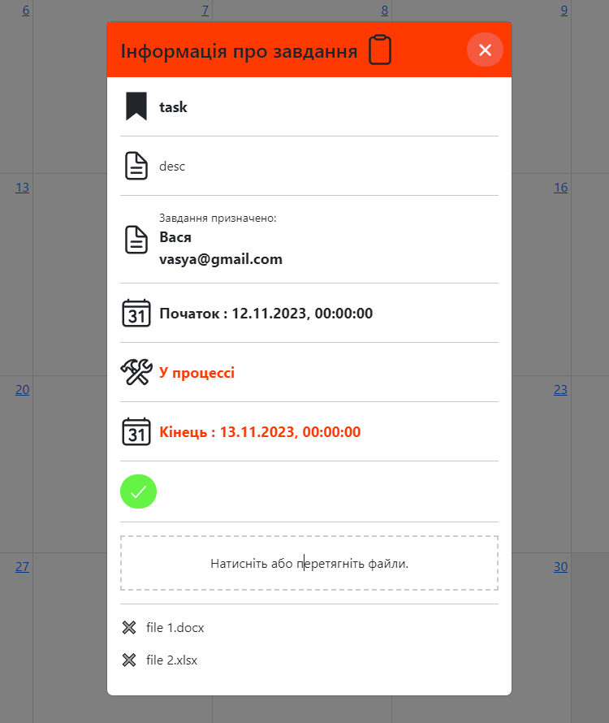

  

- Редагувати задачу
- Помітити задачу як виконану. До задачі можна прикласти файли якщо це потрібно. Вони також прийдуть по електорній почті
- Видалити задачу 

# Система сповіщень
В додаток була добавлена система сповіщень.
Є декілька сценаріїв коли користувачу приходить листа на почту:
- **При зміні статусу задачі**: лист приходить користувачуві якому назначено задачу.
  
    

 <!-- Вирівнюємо вміст по центру -->
  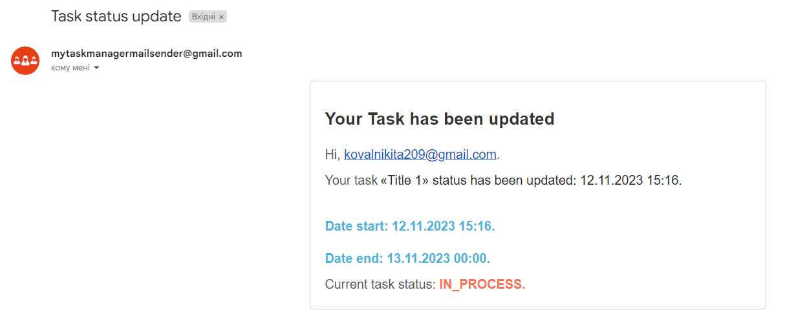

  

- **При створенні задачі**: лист приходить користувачуві якому назначено задачу, в листі буде короткий опис завдання, дата старту, дата завершення задачі а також поточний статус задачі.

    

 <!-- Вирівнюємо вміст по центру -->
  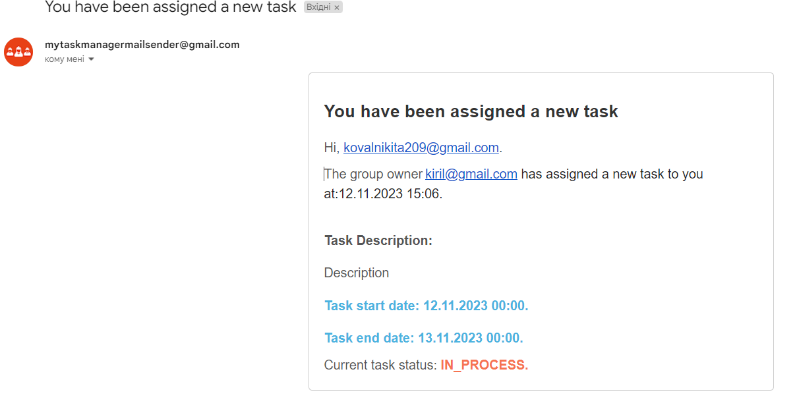

  
  
- **При виконанні задачі**: лист приходить власнику який створив задачу, в листі буде короткий опис про завдання, коли воно було зроблена та файли які відправила людина.

    

 <!-- Вирівнюємо вміст по центру -->
  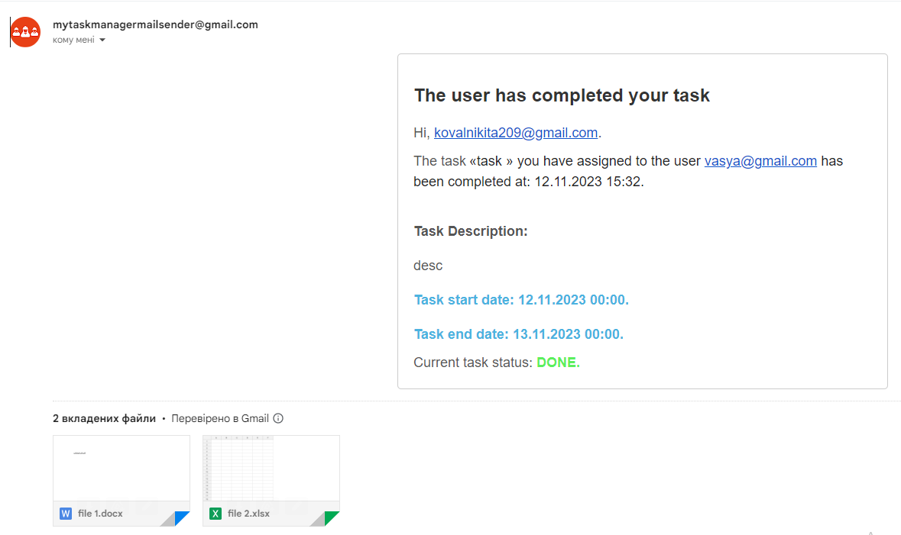

  

# Історія группи
Певні дії користвучів заносяться в історію группи. Будь-то створення задачі, редагування, виконання будуть потрапляти до істрої яку потім можна буде переглядати.

    

 <!-- Вирівнюємо вміст по центру -->
  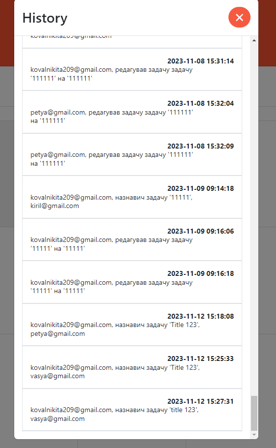

  

# Додання нових людей до групи та присвоєння інших власників

Власник групи може додавати інших людей до своєї групи. Також якщо потрібно він може надати іншим участникам групи роль **ROLE_ADIM**.

    

 <!-- Вирівнюємо вміст по центру -->
  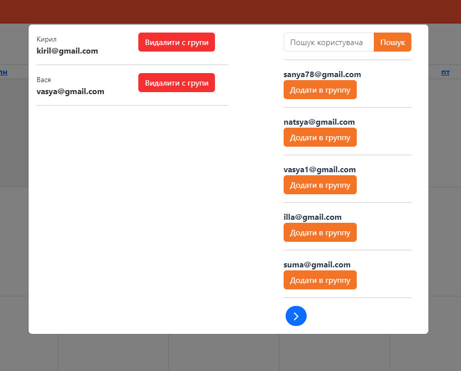

  

    

 <!-- Вирівнюємо вміст по центру -->
  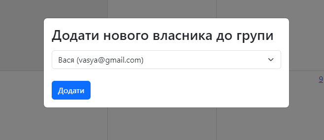

  

# Особливості

### Як визначається статус для задачі?

- **Створено**: призначаєтся задачам якщо поточна дата не дійшла до дати старту
- **У процессі**: призначаєтся задачам якщо поточна дата вже дійшла до дати старту але не дійшла до дати заврешення
- **Виконанно**: призначаєтся задачам якщо до дати завершення користувач **ВСТИГ** позначити задачу як виконанна
- **Провалено**: призначаєтся задачам якщо до дати завершення користувач **НЕ ВСТИГ** позначити задачу як виконанна

### В чому різниця ROLE_ADMIN та ROLE_USER?
Після того як користувач створив свою группу, його роль в цій грппі автоматично присвоюється **ROLE_ADMIN**

Користувач може додати до своєї группи інших людей. Їхня роль автоматично буде **ROLE_USER**. Також він може дати людям в групі роль **ROLE_ADMIN**, таким чином в одній групі може бути сразу декілька адмінів.

## ROLE_USER
**НЕ МОЖЕ:**
  - створуювати, редагувати, видаляти задачу
  - помічати задачу виконаною якщо вона не присвоєна йому
  - помічати задачу виконаною статус якої **Провалено**

**МОЖЕ:**
  - помічати задачі зі статусом **У процессі**, **Створено** якщо вони присвоєні їм

## ROLE_AMIN
**МОЖЕ:**
  - створювати задачі, редагувати, видаляти, помічати виконаним задачі, незалежно від статусу та кому присвоєна задача
  - додавати, видаляти, присвоювати роль  **ROLE_ADMIN** іншим користувачам.

# Технології які використовувались у проекті
- Java
- Spring Boot
- Spring Data
- Srping Web
- Spring Security
- Oauth2.0
- Java Mail Sender
- Thymeleaf
- MySql
- Lombok
- Docker & Docker Compose
- Maven
- HTML
- CSS
- Bootstrap
- JS
- Flyway
- FullCalendar

## Автор
MyTaskManager був створений [https://t.me/n1kkitaaa](https://t.me/n1kkitaaa)
